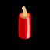
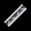

# [WAAI](https://waai.zemke.io)

## Faster R-CNN Object Recognition

[Blog](https://waai.zemke.io/object-recognition) • [Demo](https://www.youtube.com/watch?v=3sq1OArzWF8)

## TODO

- All images in the dataset originate from SingleNet.
  - Therefore `bg` from SingleNet runs should remain associated to the class.
    I.e. when SingleNet classifies sheep,
    `bg` from that inferencing should remain associated to the sheep.
    There could be a directory structure like `dataset/sheep/{0,1}/*.png`.
- Git LFS for dataset and models?
  - `alllogs`, `allreplays`
  - Keep all captures from `/getvideo` runs.
    They can be used to train the RPN later.
    Keep association to weapon.
  - Backups, too.
- Environment variables:
  - epochs
  - batch size
  - CPU/GPU

## Weapons

There are **26** weapons that reduce ammo
and of which there is enough data from replays.

### Dropped

### Attached

Weapons that are visually attached to the worms using it.

### Shot

### Thrown

### Released

Released and than having their own mind (animals).

### Airborne

Air Strikes.

### Placed

Weapons places with a click pointer cursor.

### Other

